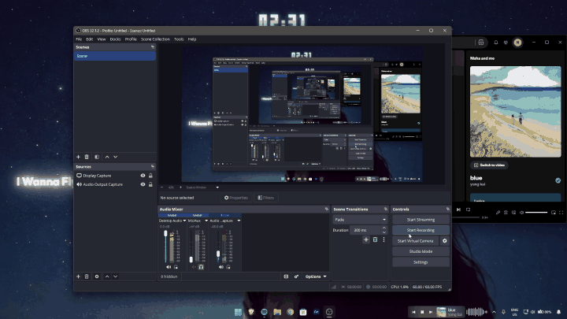

# ✨ NeonLyrics

> A borderless, transparent desktop lyrics overlay for Windows featuring Beautiful Lyrics-style word-by-word karaoke glow animations.


---

## 🎬 Live Demo

<p align="center">
  
</p>

---

## 🌟 Features

- **👻 Zero-Chrome Floating Lyrics**: Frameless and 100% transparent — only the glowing lyrics float directly above your wallpaper and open apps.
- **🎤 Word-by-Word Karaoke Glow**: Active singing line lights up syllable-by-syllable with vivid neon glow, alongside an Apple Music-style preview of the upcoming line.
- **⚡ Real-Time Spotify Sync**: Detects playback in real time via the Windows Media Session (GSMTC) with sub-second timestamp extrapolation.
- **🎶 Auto-Fetching LRC Lyrics**: Downloads synced word-level and standard LRC timestamps directly from LRCLIB API.
- **🎨 System Tray Customization Studio**:
  - **Preset Color Themes**: Cyber Aqua, Neon Pink, Aurora Mint, Sunset Amber, Diamond White, Electric Purple, Cyber Volt, Crimson Red.
  - **Custom Color Pickers**: Configure Primary Glow, Secondary Aura, Active Word, and Sung Words.
  - **Text Scaling & Glow**: Sliders for Font Size (70% - 180%) and Glow Intensity.
  - **Layering Toggle**: Stay on top of all apps or sit on the desktop layer behind apps.
  - **Windows Startup**: Auto-launch when Windows boots.

---

## 📦 Requirements

1. **Node.js** (v18 or higher)
2. **Python** (v3.10 or higher) with `winsdk`:
   ```powershell
   pip install winsdk
   ```
3. **Spotify Desktop** or any Windows Media Session supported player.

---

## 🚀 Quick Start

1. **Clone the repository:**
   ```bash
   git clone https://github.com/Nexus334023K/neon-lyrics.git
   cd neon-lyrics
   ```

2. **Install Node dependencies:**
   ```bash
   npm install
   ```

3. **Install Python dependencies:**
   ```bash
   pip install winsdk
   ```

4. **Run the application:**
   ```bash
   npm start
   # or double-click NeonLyrics.bat
   ```

---

## 🎛️ Usage & Controls

- **Move**: Click and drag the floating lyrics anywhere across your monitors.
- **Tray Menu**: Right-click the **NeonLyrics** icon in the Windows taskbar tray (near the clock) to:
  - Open the **Customization Studio & Settings**
  - Switch Quick Color Themes
  - Toggle **Always On Top**
  - Toggle **Run on Windows Startup**
  - Show / Hide Lyrics
  - Quit the app

---

## 📄 License

MIT License © 2026 Nexus334023K
